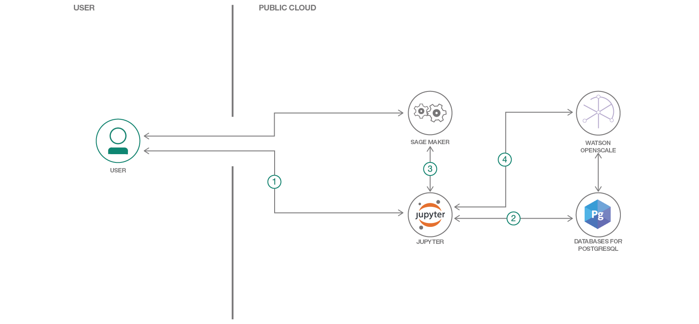

> **DISCLAIMER**: This notebook is used for demonstrative and illustrative purposes only and does not constitute an offering that has gone through regulatory review. It is not intended to serve as a medical application. There is no representation as to the accuracy of the output of this application and it is presented without warranty.

# Monitor Sagemaker ML With Watson OpenScale

In this Code Pattern, we will use data from the [UC Irvine Machine Learning database](https://archive.ics.uci.edu/ml/machine-learning-databases/breast-cancer-wisconsin/) to create a logistic regression model using Amazon SageMaker. We will use Watson OpenScale to bind the ML model deployed in the AWS cloud, create a subscription, and perform payload and feedback logging.

When the reader has completed this Code Pattern, they will understand how to:

* Prepare data, train a model, and deploy using AWS SageMaker
* Score the model using sample scoring records and the scoring endpoint
* Setup Watson OpenScale Data Mart
* Bind the SageMaker model to the Watson OpenScale Data Mart
* Add subscriptions to the Data Mart
* Enable payload logging and performance monitor for both subscribed assets
* Use Data Mart to access tables data via subscription



## Flow

1. The developer creates a Jupyter Notebook, using data from the [UCI ML database](https://archive.ics.uci.edu/ml/machine-learning-databases/breast-cancer-wisconsin/wdbc.data).
2. The Jupyter Notebook is connected to a PostgreSQL database, which is used to store Watson OpenScale data.
3. An ML model is created using AWS SageMaker, and deployed to the cloud.
4. Watson Open Scale is used by the notebook to log payload and monitor performance.

## Prerequisites

* An [IBM Cloud Account](https://console.bluemix.net).
* [IBM Cloud CLI](https://console.bluemix.net/docs/cli/index.html#overview)
* An account on [AWS SageMaker](https://aws.amazon.com/sagemaker/)

# Steps

1. [Clone the repository](#1-clone-the-repository)
1. [Create a Compose for PostgreSQL DB](#2-create-a-compose-for-postgresql-db)
1. [Create a Watson OpenScale service](#3-create-a-watson-openscale-service)
1. [Run the notebooks](#4-run-the-notebooks)

### 1. Clone the repository

```bash
git clone https://github.com/IBM/monitor-sagemaker-ml-with-watson-openscale
cd monitor-sagemaker-ml-with-watson-openscale
```

### 2. Create a Compose for PostgreSQL DB

* Using the [IBM Cloud Dashboard](https://console.bluemix.net/catalog) catalog, search for PostgreSQL and choose the `Compose for Postgres` service:


* Wait a couple of minutes for the database to be provisioned.
* Click on the `Service Credentials` tab on the left and then click `New credential +` to create the service credentials. Copy them or leave the tab open to use later in the notebook.

### 3. Create a Watson OpenScale service

* Using the [IBM Cloud Dashboard](https://console.bluemix.net/dashboard/apps) create a [Watson OpenScale](https://console.bluemix.net/catalog/services/ai-openscale) service.
* You will get the Watson OpenScale instance GUID when you run the notebook using the [IBM Cloud CLI](https://console.bluemix.net/catalog/services/ai-openscale)

### 4. Run the notebooks

#### There are 2 notebooks for this pattern. Begin by running [BreastCancerSageMaker.ipynb](notebooks/BreastCancerSageMaker.ipynb).

* You will need to [setup AWS SageMaker]( https://docs.aws.amazon.com/sagemaker/latest/dg/gs-set-up.html)
* Insert your AWS credentials after the cell `Upload data to S3 Object Storage`.
* Insert your AWS S3 `bucket_name` after the cell `2.4 Create an S3 bucket and use the name in the cell below for bucket_name`
* Move your cursor to each code cell and run the code in it. Read the comments for each cell to understand what the code is doing. **Important** when the code in a cell is still running, the label to the left changes to **In [\*]**:.
  Do **not** continue to the next cell until the code is finished running.

#### Next Run [WatsonopenScaleSageMakerMLengine.ipynb](notebooks/WatsonOpenScaleSageMakerMLengine.ipynb)

* Follow the instructions for `ACTION: Get Watson OpenScale instance_guid and apikey` using the [IBM Cloud CLI](https://console.bluemix.net/docs/cli/index.html#overview)

How to get api key using ibmcloud console:
```bash
ibmcloud login --sso
ibmcloud iam api-key-create 'my_key'
```

How to get your Watson OpenScale instance GUID:
```bash
ibmcloud resource service-instance <WatsonOpenScale_instance_name>
```

* Enter the `instance_guid` and `apikey` in the next cell for the `WATSON_OS_CREDENTIALS`.
* In the cell after that enter `POSTGRES_CREDENTIALS` using the value for the PostreSQL credentials from [Step #2](#2-create-a-compose-for-postgresql-db).
* In the cell after `2.1 Bind SageMaker machine learning engine` enter your `SAGEMAKER_ENGINE_CREDENTIALS`.
* After running `3.1 Add subscriptions` you will get a `source_uid` to enter in the cell that follows.
* Move your cursor to each code cell and run the code in it. Read the comments for each cell to understand what the code is doing. **Important** when the code in a cell is still running, the label to the left changes to **In [\*]**:.
  Do **not** continue to the next cell until the code is finished running.

# Sample Output

See the [example output for Predicting Breast Cancer](examples/BreastCancerSageMakerExampleOutput.ipynb)
See the [example output for Working with SageMaker Machine Learning engine](examples/WatsonopenScaleSageMakerMLengineExampleOutput.ipynb)

# License

This code pattern is licensed under the Apache License, Version 2. Separate third-party code objects invoked within this code pattern are licensed by their respective providers pursuant to their own separate licenses. Contributions are subject to the [Developer Certificate of Origin, Version 1.1](https://developercertificate.org/) and the [Apache License, Version 2](https://www.apache.org/licenses/LICENSE-2.0.txt).

[Apache License FAQ](https://www.apache.org/foundation/license-faq.html#WhatDoesItMEAN)
